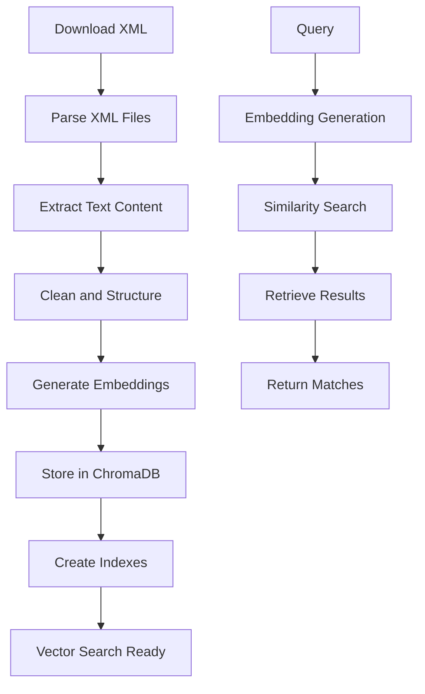

# Turgot Database

This directory contains the database processing and vector store management for Turgot. It handles the ingestion, processing, and storage of French public administration data from Service-Public.fr into a ChromaDB vector database for efficient semantic search and RAG operations.

## Overview

The database module provides:

- **Data Acquisition**: Automated download of Service-Public.fr XML dumps
- **XML Processing**: Parsing and structuring of government administration data
- **Vector Database**: ChromaDB management with persistent storage
- **Embedding Generation**: Mistral AI-powered text embeddings for semantic search
- **Data Pipeline**: Complete ETL pipeline from raw XML to searchable vectors
- **Testing Framework**: Comprehensive testing utilities for vector operations

## Technical Stack

- **Vector Database**: ChromaDB with persistent file storage
- **AI/ML**:
  - LangChain for document processing and embeddings
  - Mistral AI for text embeddings
  - ChromaDB for vector similarity search
- **Data Processing**:
  - Python XML parsing with ElementTree
  - TQDM for progress tracking and monitoring
  - Loguru for structured logging
- **Python Version**: 3.13+
- **Package Management**: UV for dependency management

## Project Structure

```
database/
├── chroma_db/                    # ChromaDB persistent storage
│   ├── chroma.sqlite3           # SQLite database (546MB)
│   └── collections/             # Vector collections storage
├── data/                        # Raw and processed data
│   ├── xml_dumps/              # Downloaded XML files
│   └── processed/              # Cleaned and structured data
├── parse_xml_dump.py           # Main XML processing pipeline
├── parse_xml_dump_debug.py     # Debug version with detailed logging
├── download.py                 # Data download automation
├── test_vector_db.py           # Vector database testing
├── test_turgot_vector.py      # Turgot-specific vector tests
├── test_parse_xml.ipynb        # Interactive XML parsing notebook
├── pyproject.toml              # Dependencies and project config
└── uv.lock                     # Locked dependency versions
```

## Data Sources

The system processes official French government data from:

### Service-Public.fr

- **XML Dumps**: Complete database exports from data.gouv.fr
- **Vosdroits Dataset**: Comprehensive rights and procedures information
- **Schema Definitions**: XML schema for proper data parsing
- **Update Frequency**: Regular updates to maintain data freshness

### Data Structure

The processed data includes:

- Administrative procedures and requirements
- Citizen rights and obligations
- Official forms and documents
- Contact information for government services
- Legal references and regulatory information

## Setup

### Prerequisites

- Python 3.13+
- Internet connection for data downloads
- Sufficient disk space (2GB+ for full database)
- Mistral AI API access for embeddings

### Installation

1. **Create and activate virtual environment**:

```bash
python -m venv .venv
source .venv/bin/activate  # On Windows: .venv\Scripts\activate
```

2. **Install dependencies** (using UV):

```bash
# Install UV if not available
pip install uv

# Install project dependencies
uv pip install -e .
```

3. **Set up environment variables**:

```bash
cp .env.example .env
```

Edit `.env` with your configuration:

```bash
# Required
MISTRAL_API_KEY=your_mistral_api_key_here

# Optional
LOG_LEVEL=INFO
CHROMA_DB_PATH=chroma_db/
BATCH_SIZE=100
MAX_WORKERS=4
```

## Usage

### Data Pipeline

#### 1. Download Data

Download the latest Service-Public.fr XML dumps:

```bash
python download.py
```

This will:

- Fetch the latest XML dumps from data.gouv.fr
- Extract compressed files to `data/xml_dumps/`
- Validate file integrity
- Clean up temporary files

#### 2. Process and Index Data

Process XML files and create vector embeddings:

```bash
python parse_xml_dump.py
```

This will:

- Parse XML files with progress tracking
- Extract and clean text content
- Generate embeddings using Mistral AI
- Store vectors in ChromaDB
- Create searchable indexes

#### 3. Debug Processing (Optional)

For detailed debugging and monitoring:

```bash
python parse_xml_dump_debug.py
```

Features:

- Detailed logging of each processing step
- Error handling and recovery
- Performance monitoring
- Memory usage tracking

### Testing and Validation

#### Vector Database Tests

```bash
# Basic vector operations
python test_vector_db.py

# turgot-specific functionality
python test_turgot_vector.py
```

#### Interactive Development

```bash
# Start Jupyter for interactive testing
jupyter notebook

# Open the notebook
# test_parse_xml.ipynb
```

## Data Flow



### Processing Steps

1. **XML Parsing**: Extract structured data from Service-Public.fr dumps
2. **Content Extraction**: Parse text content, metadata, and relationships
3. **Data Cleaning**: Remove HTML, normalize text, handle encoding
4. **Chunking**: Split large documents into searchable segments
5. **Embedding**: Generate vector representations using Mistral AI
6. **Storage**: Persist vectors in ChromaDB with metadata
7. **Indexing**: Create efficient search indexes for fast retrieval

### Configuration

#### Environment Variables

```bash
# API Configuration
MISTRAL_API_KEY=your_api_key

# Database Settings
CHROMA_DB_PATH=chroma_db/
COLLECTION_NAME=service_public_fr

# Processing Settings
BATCH_SIZE=100              # Documents per batch
MAX_WORKERS=4               # Parallel processing threads
CHUNK_SIZE=1000             # Text chunk size for embeddings
OVERLAP=200                 # Chunk overlap for context

# Logging
LOG_LEVEL=INFO
LOG_FILE=processing.log
```

## License

This project is licensed under the Creative Commons Attribution-NonCommercial 4.0 (CC BY-NC 4.0) license.
